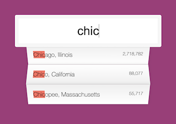

# Ajax Type Ahead

## Description

This is the sixth exercise in the Wes Bos JavaScript 30 challenge. Event listeners were added to the input and that value was used to filter through a city array and return cities or states with the specified values.

- My motivation was to continue to build my skillset
- This exercise utilized regular expressions in ways I haven't worked with before.
- I particularly liked learning about how to add the highlighted portions using the regex.

## Usage

On page load, the user is prompted to input a city or state name. With each key stroke, a list is populated with possible matches. The portion that is input is also highlighted on the suggestions.

[Live Gallery Page](katemcro.github.io/typeAheadJS30_06/)

## Credits

This project is from Wes Bos' free [#JavaScript30](https://javascript30.com/) coding challenge.
